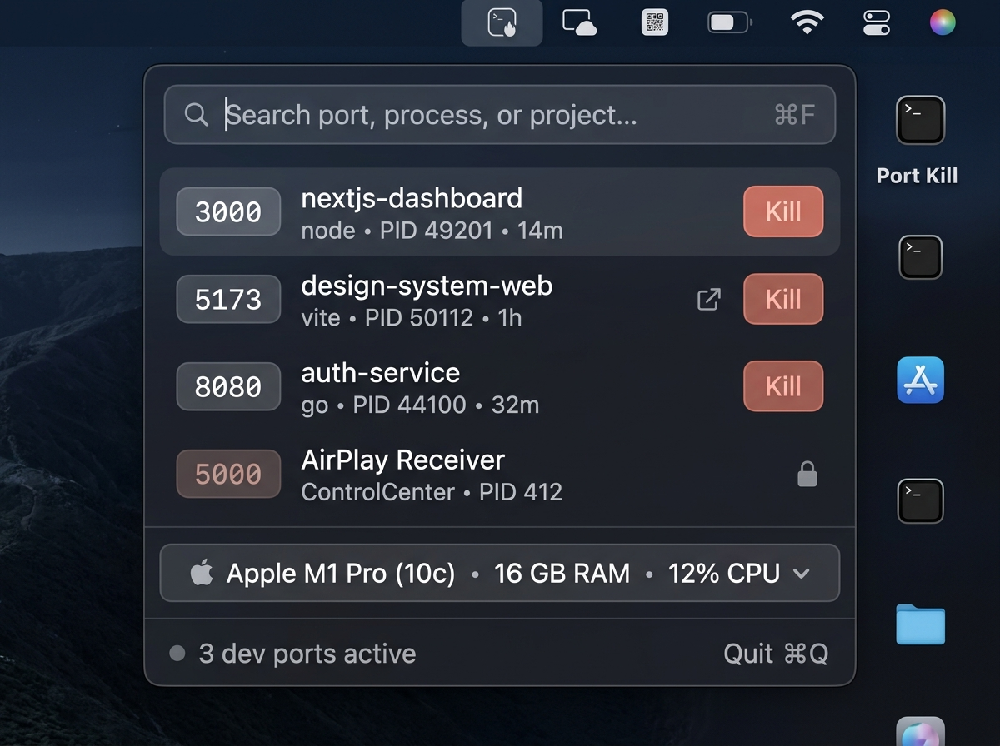

<h1 align="center">PortKill</h1>

<p align="center">
  See what's listening on your local ports, which project it belongs to, and stop it in one click.<br />
  A small, native macOS menu bar app for developers.
</p>

<p align="center">
  <a href="https://github.com/fr3on/portkill/actions/workflows/ci.yml"></a>
  <a href="LICENSE"></a>
  
</p>

<p align="center">
  
</p>

No more `lsof -i :3000` followed by `kill -9 <PID>`.

## Features

**Find**
- Lists every process listening on a local TCP port, with PID, uptime and memory use.
- Shows the project behind each port by finding the nearest `.git`, `package.json`, `Package.swift`, `pyproject.toml`, `Pipfile`, `Cargo.toml`, `go.mod`, `Gemfile`, `composer.json`, `pom.xml`, `build.gradle(.kts)` or `mix.exs` above the process's working directory.
- Groups a process's ports on one row. Ports published by Docker show the container name and image (the row is read-only; copy `docker stop <name>`).
- Optionally lists UDP sockets.
- Filters by port, command or project name.

**Act**
- Kills with `SIGTERM` first. If the process is still running after 3 seconds, offers **Force Kill** (`SIGKILL`).
- Click a port badge to copy `localhost:<port>`. Hover a row to open it in your browser.
- Click a row for details: command, user, start time, project folder, Reveal in Finder, Copy Path, Open in Terminal, and copyable `kill <PID>` / `lsof` snippets.
- `⌘F` searches, `Esc` clears, `⌘R` refreshes. The gear menu has Launch at Login, an optional port count in the menu bar, a system-process toggle and a terminal picker.

**Stay out of the way**
- Runs `docker ps` only when Docker is actually publishing a port, and only against a local Docker socket (never a remote `DOCKER_HOST`).
- Polls only while the popover is open. The optional menu bar count adds one light `lsof` every 10 seconds while it is closed.
- No analytics or third-party dependencies. The only network request is the optional "Check for Updates…" (one request to `api.github.com`), and only when you choose it. PortKill never checks on its own.
- Follows the system light and dark appearance.

The popover also shows your chip, memory and live CPU load. On M1–M4 Macs it adds a rough GPU compute estimate.

## Install

### Download

Get the latest `PortKill-<version>.dmg` from [Releases](https://github.com/fr3on/portkill/releases), open it and drag PortKill to Applications.

PortKill is not notarized by Apple, so macOS blocks it the first time you open it. To allow it:

1. Try to open PortKill once, then dismiss the warning.
2. Open **System Settings → Privacy & Security**, scroll down, and click **Open Anyway** next to PortKill.
3. Confirm with your password.

Or remove the quarantine flag from a terminal:

```bash
xattr -dr com.apple.quarantine /Applications/PortKill.app
```

If you'd rather not trust a prebuilt binary, build it from source below. That build runs without a warning on your own Mac.

### Build from source

Needs macOS 14+ and Swift 6 (Xcode or the Command Line Tools).

```bash
git clone https://github.com/fr3on/portkill.git
cd portkill
./scripts/build-app.sh      # builds build/PortKill.app (universal: Apple silicon + Intel)
open build/PortKill.app
```

PortKill has no Dock icon. Look for it in the menu bar.

## Safety

PortKill only signals processes it is sure about:

- **Read-only rows.** PID 0 and 1, PortKill itself, processes owned by other users or root, and known macOS system services can't be killed. They show a lock.
- **Two stages.** A graceful `SIGTERM` always comes before `SIGKILL`, and Force Kill is a separate click.
- **No recycled PIDs.** Before signalling, PortKill checks that the PID still belongs to the process you saw. If it doesn't, nothing is sent.
- **One process at a time.** There is no "kill all".

System processes and other users' processes are hidden by default.

## Privacy

PortKill runs `lsof`, `ps` and, when Docker is publishing ports, `docker ps` on your Mac and sends signals to your own processes. It collects nothing and makes no network requests, except the one to `api.github.com` when you choose "Check for Updates…". Docker is only queried through a local socket. It isn't sandboxed because it has to inspect other processes. It uses the Hardened Runtime with no extra entitlements. See [SECURITY.md](SECURITY.md) to report a problem.

## Development

```bash
swift build          # compile
swift test           # run the tests
./scripts/build-app.sh   # package build/PortKill.app
./scripts/make-dmg.sh    # wrap it in dist/PortKill-<version>.dmg
```

```
Sources/
  PortKillCore/   Scanning, lsof parsing, project detection, kill rules. No UI imports.
  PortKill/       SwiftUI app: menu bar item, views, design system.
Tests/            Swift Testing suites. lsof samples live in Fixtures/.
scripts/          build-app, make-dmg, release, make-icon
docs/images/      README screenshots
```

Contributions are welcome. Read [CONTRIBUTING.md](CONTRIBUTING.md) first, and follow the [Code of Conduct](CODE_OF_CONDUCT.md).

## License

[MIT](LICENSE)
